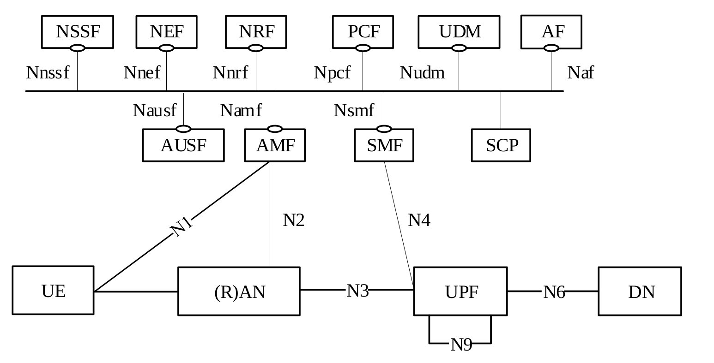

<table style="border-collapse: collapse; border: none;">
  <tr style="border-collapse: collapse; border: none;">
    <td style="border-collapse: collapse; border: none;">
      <a href="http://www.openairinterface.org/">
         
         </img>
      </a>
    </td>
    <td style="border-collapse: collapse; border: none; vertical-align: center;">
      <b>OpenAirInterface LMF Feature Set</b>
    </td>
  </tr>
</table>

**Table of Contents**

1. [5GC Service Based Architecture](#1-5gc-service-based-architecture)
2. [OAI LMF Available Interfaces](#2-oai-lmf-available-interfaces)
3. [OAI LMF Feature List](#3-oai-lmf-feature-list)

# 1. 5GC Service Based Architecture #

# 2. OAI LMF Available Interfaces #

| **ID** | **Interface** | **Status**         | **Comment**                                                               |
| ------ | ------------- | ------------------ | --------------------------------------------------------------------------|
| 1      | NL1           | :heavy_check_mark: | NL1 interface connects the LMF to the UE (via AMF)                        |

# 3. OAI LMF Feature List #

Based on document **TS 23.273 (section 4.3.8 of TS 23.273)**.

|**ID**| **Classification**                                                                     | **Status**   | **Comments** |
| ---- | -------------------------------------------------------------------------------------- | ------------ |--------------|
| 1    | Support a request for a single location received from a serving AMF for a target UE    |:heavy_check_mark:          |              |
| 2    | Support a request for periodic or triggered location received from a serving AMF       | :x:          |              |
|      | for a target UE                                                                        |              |              |
| 3    | Determine type and number of position methods and procedures based on UE and PLMN      | :x:          |              |
|      | capabilities, QoS, UE connectivity state per access type, LCS Client type,             |              |              |
|      | co-ordinate type and optionally service type                                           |              |              |
| 4    | Report UE location estimates directly to a GMLC for periodic or triggered location     | :x:          |              |
|      | of a target UE                                                                         |              |              |
| 5    | Support cancelation of periodic or triggered location for a target UE                  | :x:          |              |
| 6    | Support the provision of broadcast assistance data to UEs via NG-RAN in ciphered       | :x:          |              |
|      | or unciphered form and forward any ciphering keys to subscribed UEs via the AMF        |              |              |
| 7    | Support change of a serving LMF for periodic or triggered location reporting for       | :x:          |              |
|      | a target UE                                                                            |              |              |

      
